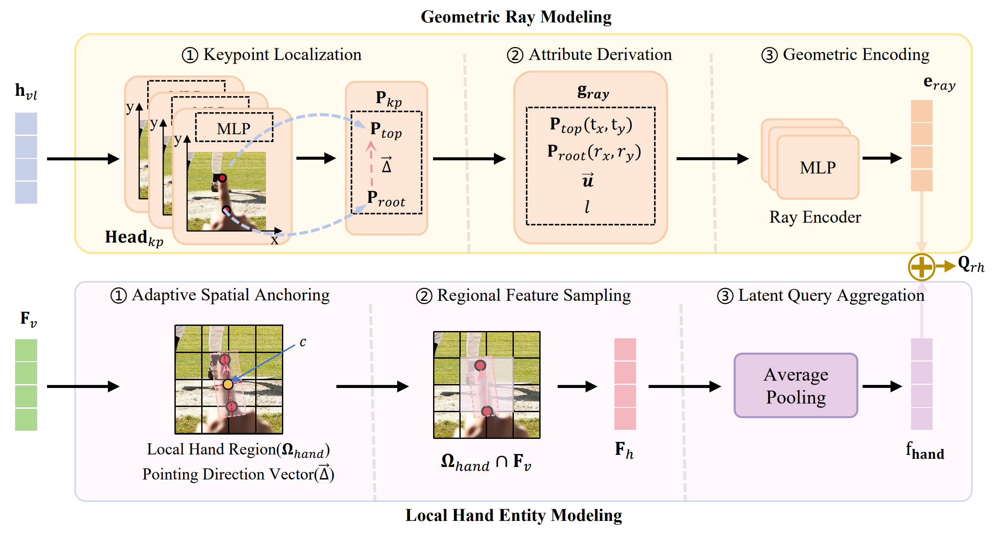
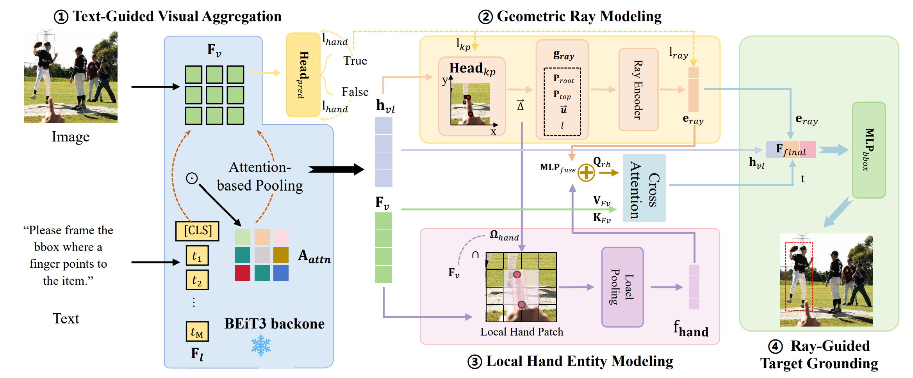

# VistaRef

VistaRef addresses pointing drift in deictic gesture grounding by explicitly modeling micro-geometric relationships. Via LHEM and GRM modules with OCAL loss, it transforms implicit pose cues into explicit spatial features, achieving a **+14% absolute gain** in grounding accuracy.

Highlights · Architecture · Quick Start · Data Format · Loss Design · Evaluation

## Overview

VistaRef is a visual grounding model specialized for egocentric pointing scenarios. Built on top of BEiT-3 and extended from OneRef, it predicts not only the target object bounding box but also hand keypoints and hand presence, using geometric reasoning to resolve the pointing drift problem inherent in standard referring expression comprehension.

The current codebase is centered around:

- **Multi-task supervised training** with DDP + optional DeepSpeed
- **Multi-modal** text-image inputs with BEiT-3 vision-language backbone
- **Geometric reasoning** via LHEM (Likelihood-based Hand Encoding Module) and GRM (Geometric Relation Module)
- **OCAL loss** (Orientation-Corrected Attention Loss) combining bbox, keypoint, ray distance, and angle constraints
- **EMA-normalized multi-task loss** balancing for stable heterogeneous optimization




## Highlights

- End-to-end training pipeline for pointing-aware visual grounding
- Novel **LHEM** module extracting pseudo-hand features from predicted keypoints via oriented bounding boxes
- Novel **GRM** module encoding ray geometry and attending from hand-query to target object regions
- **OCAL loss** jointly supervising box regression, keypoint localization, ray geometry, and hand classification
- Two-stage training protocol (frozen-backbone warmup → full finetuning)
- Task-IoU evaluation metric that jointly accounts for hand classification correctness and box accuracy
- Compatible with RefCOCO / RefCOCO+ / RefCOCOg / Flickr30K Entities / EgoPoint datasets

## Architecture

VistaRef extends the BEiT-3 multimodal transformer with four task-specific heads:

1. **Bounding Box Head** — MLP that predicts normalized xywh box from vision-language fused features
2. **Keypoint Head** — MLP predicting hand root and fingertip coordinates
3. **Hand Classification Head** — binary classifier for hand presence in the image
4. **OCAL Module** — geometric reasoning core with two sub-modules:
   - **LHEM**: extracts hand-region features from predicted keypoints using an oriented bounding box aligned with the pointing ray
   - **GRM**: encodes 7-dim ray geometry (root, tip, unit vector, length) via a 3-layer MLP, then attends from the fused hand-ray query to all visual patch features via multi-head cross-attention

The final box regression fuses three feature sources: standard visual grounding features, ray geometric embedding, and attention-attended target features from GRM.

## Repository Structure

```
VistaRef/
├── train_VistaRef.py              # Main training launcher
├── eval_VistaRef.py               # Evaluation script with task-IoU metrics
├── eval.py                        # Standard OneRef-style evaluation
├── engine.py                      # Training, validation, and evaluation loops
├── requirements.txt               # Python dependencies
├── models/
│   ├── VistaRef_model.py          # BEiT3ForGrounding — main model with LHEM/GRM/OCAL
│   ├── BEiT3.py                   # BEiT-3 vision-language backbone
│   ├── Encoder.py                 # Transformer encoder with multiway attention
│   ├── modeling_utils.py          # BEiT3Wrapper, base/large configs
│   ├── mlm_decoder.py             # MLM decoder transformer
│   ├── modeling_vqkd.py           # VQKD tokenizer for MIM pretraining
│   └── utils.py                   # ClipLoss, NativeScaler, distributed helpers
├── datasets/
│   ├── data_loader.py             # TransVGDataset — main data loader
│   ├── data_loader_with_mim.py    # MIM/MLM pretraining dataset
│   ├── egopoint.py                # EgoPoint jsonl reader
│   ├── transforms.py              # Image/box/keypoint augmentations
│   └── masking_generator.py       # MIM mask generators (BEiT3/MAE/Dynamic)
├── utils/
│   ├── loss_utils.py              # one_ref_loss, fuse_normalized_losses — all loss functions
│   ├── eval_utils.py              # IoU and task-IoU computation
│   ├── box_utils.py               # bbox_iou, xywh2xyxy, generalized_box_iou
│   ├── transforms.py              # Image augmentations (ColorJitter, RandomResize, etc.)
│   └── misc.py                    # collate_fn, NestedTensor, MetricLogger
├── train_and_eval_script/
│   ├── train_rec_egopoint_single_dataset_finetuning_base.sh
│   ├── train_rec_egopoint_single_dataset_finetuning_large.sh
│   ├── eval_rec_egopoint_single_dataset_finetuning_base.sh
│   └── eval_rec_egopoint_single_dataset_finetuning_large.sh
└── README.md
```

Key components:

- [train_VistaRef.py](train_VistaRef.py): training launcher with full argument interface
- [engine.py](engine.py): `train_one_epoch()`, `train_one_epoch_with_mrefm()`, and `validate()` loops
- [models/VistaRef_model.py](models/VistaRef_model.py): `BEiT3ForGrounding` model with LHEM, GRM, and OCAL modules
- [utils/loss_utils.py](utils/loss_utils.py): `one_ref_loss()` and EMA-normalized multi-task loss fusion
- [datasets/](datasets/): recommended location for training and validation data in preprocessed `.pth` format

## Environment Setup

We recommend creating a dedicated conda environment.

### 1. Create and activate environment

```bash
conda create -n vistaref python=3.10 -y
conda activate vistaref
```

Recommended Python version: `python==3.10`

### 2. Install required packages

```bash
pip install torch torchvision
pip install timm==0.6.13
pip install Pillow numpy einops tensorboardX scipy opencv-python
pip install sentencepiece transformers deepspeed
pip install torchscale==0.3.0
pip install spacy ftfy pycocotools
python -m spacy download en_core_web_md
```

The main dependencies validated in our local environment:

| Package | Version |
|---|---|
| torch | ≥2.0 |
| torchvision | ≥0.15 |
| timm | 0.6.13 |
| torchscale | 0.3.0 |
| transformers | ≥4.30 |
| deepspeed | ≥0.10 |
| sentencepiece | latest |
| spacy (en_core_web_md) | ≥3.0 |

## Quick Start

### 1. Prepare data and model weights

Download pretrained weights from [OneRef HuggingFace](https://huggingface.co/linhuixiao/OneRef):

| Weight | Description | Link |
|---|---|---|
| `beit3.spm` | Sentencepiece tokenizer | [Download](https://huggingface.co/linhuixiao/OneRef/resolve/main/beit3_checkpoints/beit3.spm) |
| BEiT-3 Base | Original BEiT-3 base checkpoint | [Download](https://huggingface.co/linhuixiao/OneRef/resolve/main/beit3_checkpoints/beit3_base_indomain_patch16_224.pth) |
| BEiT-3 Large | Original BEiT-3 large checkpoint | [Download](https://huggingface.co/linhuixiao/OneRef/resolve/main/beit3_checkpoints/beit3_large_indomain_patch16_224.pth) |
| MRefM Base (REC) | MRefM pretrained base for REC | [Download](https://huggingface.co/linhuixiao/OneRef/resolve/main/mrefm_pretrain_patch16_384/rec_mrefm_pretrain_base_patch16_384.pth) |
| MRefM Large (REC) | MRefM pretrained large for REC | [Download](https://huggingface.co/linhuixiao/OneRef/resolve/main/mrefm_pretrain_patch16_384/rec_mrefm_pretrain_large_patch16_384.pth) |

You can also download the original BEiT-3 checkpoints from the [official UNILM repo](https://github.com/microsoft/unilm/tree/master/beit3).

Place preprocessed datasets under `ref_data_shuffled/` or configure custom paths.

### 2. Update paths in the training script

Edit [train_and_eval_script/train_rec_egopoint_single_dataset_finetuning_base.sh](train_and_eval_script/train_rec_egopoint_single_dataset_finetuning_base.sh):

```bash
DATA_ROOT=/path/to/image
SPLIT_ROOT=/path/to/split
OUTPUT_ROOT_BASE=/path/to/output_base
FINETUNE_INIT=/path/to/rec_mrefm_pretrain_base_patch16_384.pth
SENTENCEPIECE_MODEL=/path/to/beit3.spm
```

### 3. Launch training

```bash
bash train_and_eval_script/train_rec_egopoint_single_dataset_finetuning_base.sh
```

The script runs a two-stage protocol:

**Stage 1 — Warmup** (10 epochs, frozen backbone):
```bash
python train_VistaRef.py \
  --epochs 10 --batch_size 64 --lr 0.00025 \
  --lr_scheduler cosine --frozen_backbone \
  --model beit3_base_patch16_384 --task grounding \
  --dataset egopoint --imsize 384 --max_query_len 64 \
  --use_regress_box \
  --loss_ema_momentum 0.99 \
  --loss_orig_weight 0.7 --loss_new_weight 0.3 \
  --loss_hand_ratio 0.2 --loss_kp_ratio 0.4 \
  --loss_ray_ratio 0.3 --loss_angle_ratio 0.1 \
  --finetune ${FINETUNE_INIT} \
  --data_root ${DATA_ROOT} --split_root ${SPLIT_ROOT} \
  --output_dir ${OUTPUT_ROOT}/v001/egopoint
```

**Stage 2 — Finetuning** (20 epochs, full model):
```bash
python train_VistaRef.py \
  --epochs 20 --batch_size 8 --lr 0.00003 \
  --lr_scheduler cosine \
  --model beit3_base_patch16_384 --task grounding \
  --dataset egopoint --imsize 384 --max_query_len 64 \
  --use_regress_box --use_box_mask_constraints \
  --loss_ema_momentum 0.99 \
  --loss_orig_weight 0.7 --loss_new_weight 0.3 \
  --loss_hand_ratio 0.2 --loss_kp_ratio 0.4 \
  --loss_ray_ratio 0.3 --loss_angle_ratio 0.1 \
  --finetune ${OUTPUT_ROOT}/v001/egopoint/best_checkpoint.pth \
  --data_root ${DATA_ROOT} --split_root ${SPLIT_ROOT} \
  --output_dir ${OUTPUT_ROOT}/v002/egopoint
```

### 4. Main runtime knobs

| Parameter | Description |
|---|---|
| `--lr` | Base learning rate |
| `--lr_scheduler` | LR schedule: `step`, `cosine`, or `poly` |
| `--batch_size` | Per-GPU batch size |
| `--epochs` | Total training epochs |
| `--imsize` | Input image size (384 recommended) |
| `--frozen_backbone` | Freeze BEiT-3 backbone (warmup stage) |
| `--use_regress_box` | Enable box regression head |
| `--use_box_mask_constraints` | Enable mask-constrained box loss |
| `--use_hand_branch` | Enable hand classification head |
| `--use_kp_branch` | Enable keypoint prediction head |
| `--use_ocal_module` | Enable OCAL geometric reasoning module |
| `--loss_orig_weight` | Weight for original bbox+GIoU losses (default 0.7) |
| `--loss_new_weight` | Weight for new hand+kp+ray+angle losses (default 0.3) |
| `--loss_kp_ratio` | Keypoint loss ratio within new losses (default 0.4) |
| `--loss_ray_ratio` | Ray distance loss ratio (default 0.3) |
| `--loss_angle_ratio` | Angle cosine loss ratio (default 0.1) |
| `--loss_hand_ratio` | Hand classification loss ratio (default 0.2) |
| `--enable_deepspeed` | Enable DeepSpeed for memory-efficient training |

## Data Format

The dataset is loaded through [datasets/data_loader.py](datasets/data_loader.py). Each sample is a preprocessed `.pth` tuple.

### Standard format (5 fields)

```python
(img_file, img_size_dict, bbox, phrase, obj_mask)
```

### VistaRef extended format (9 fields)

```python
(img_file, img_size_dict, bbox, phrase, obj_mask,
 kp_root, kp_tip, kp_valid, is_positive)
```

| Field | Type | Description |
|---|---|---|
| `img_file` | str | Path to the image file |
| `img_size_dict` | dict | `{"height": H, "width": W}` |
| `bbox` | list | Target object box in xywh (pixel coordinates) |
| `phrase` | str | Referring expression text |
| `obj_mask` | numpy array | Object segmentation mask |
| `kp_root` | [x, y] | Hand root (wrist) in pixel coordinates |
| `kp_tip` | [x, y] | Fingertip in pixel coordinates |
| `kp_valid` | 0/1 | Whether keypoints exist for this sample |
| `is_positive` | 0/1 | Positive (hand pointing at target) vs. negative sample |

The collate function in [utils/misc.py](utils/misc.py) normalizes boxes to `[0, 1]` in xywh format and pads images to a fixed size (default 384×384). Keypoint coordinates are propagated through augmentations (crop, resize, flip, normalize).

### Supported datasets

`referit` · `unc` (RefCOCO) · `unc+` (RefCOCO+) · `gref` (RefCOCOg) · `flickr` (Flickr30K Entities) · `egopoint`

## Loss Design

The loss function is defined in [utils/loss_utils.py](utils/loss_utils.py) as `one_ref_loss()`.

### Original losses (OneRef)

- **`loss_bbox`** — L1 loss on normalized xywh box predictions
- **`loss_giou`** — 1 − GIoU between predicted and ground-truth boxes
- **`loss_contrastive`** — CLIP-style vision-language contrastive alignment (optional)
- **`loss_mrm_focal / loss_mrm_dice`** — box mask constraint losses (optional)

### VistaRef geometric losses

- **`loss_hand_cls`** — BCEWithLogitsLoss for hand presence classification
- **`loss_kp`** — SmoothL1 loss on keypoint coordinates, masked by `kp_valid & is_positive`
- **`loss_ray`** — Perpendicular distance from GT box center to the predicted pointing ray
- **`loss_angle`** — 1 − cosine_similarity(predicted_ray_direction, GT center-to-tip direction)

### Loss fusion

Raw losses are normalized using EMA statistics via `fuse_normalized_losses()`:

```
total = orig_weight · (loss_bbox + loss_giou)
       + new_weight · (hand_ratio · loss_hand + kp_ratio · loss_kp
                       + ray_ratio · loss_ray + angle_ratio · loss_angle)
```

Default weights: `orig_weight=0.7`, `new_weight=0.3`, `hand_ratio=0.2`, `kp_ratio=0.4`, `ray_ratio=0.3`, `angle_ratio=0.1`.

## Evaluation

Run evaluation with the provided eval script:

```bash
python eval_VistaRef.py \
  --num_workers 4 --batch_size 128 \
  --imsize 384 --max_query_len 64 \
  --model beit3_base_patch16_384 \
  --task grounding --dataset egopoint \
  --eval_set test \
  --data_root ${DATA_ROOT} \
  --split_root ${SPLIT_ROOT} \
  --sentencepiece_model ${SENTENCEPIECE_MODEL} \
  --eval_model ${OUTPUT_ROOT}/v002/egopoint/best_checkpoint.pth \
  --output_dir ${OUTPUT_ROOT}/v002/egopoint
```

Metrics reported:

- **Precision@0.3 / 0.5 / 0.7** — box accuracy at IoU thresholds
- **mIoU** — mean IoU across all samples
- **Task-IoU** — joint metric: hand classification correctness × box IoU
- **Hand Acc** — hand presence classification TP/FP/TN/FN
- **Inference speed** — samples per second

Add `--visualize` to save prediction visualizations with predicted boxes, keypoints, and hand regions.

## Notes

- This repository extends OneRef (BEiT-3 based visual grounding) with pointing-specific geometric reasoning modules
- The default setup assumes a single-GPU or multi-GPU DDP environment; DeepSpeed is optional via `--enable_deepspeed`
- You may want to adapt batch size, image size, and loss weights to your specific dataset and hardware budget
- MRefM-pretrained checkpoints provide stronger initialization than vanilla BEiT-3 for grounding tasks
